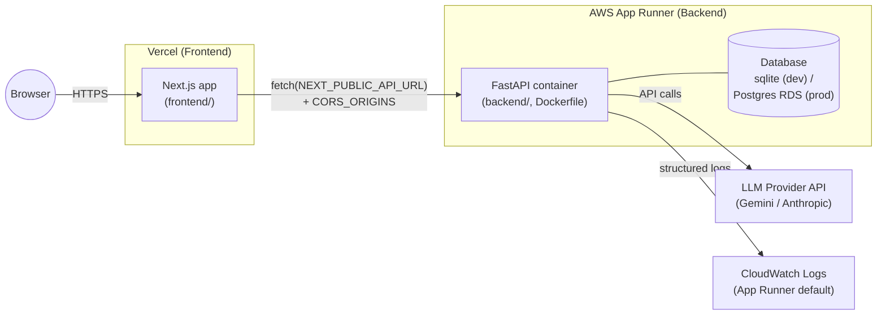

# Deployment Guide

> **Status: configuration only, not a live deployment.** This document and
> the accompanying config files (`backend/Dockerfile`, `backend/apprunner.yaml`,
> `frontend/vercel.json`, `.env.example` updates) make the app *deployable*.
> No infrastructure has actually been provisioned as part of this change —
> there are no cloud credentials available in this environment. A human with
> AWS/Vercel access still needs to run the steps below to get a real,
> reachable URL.

## Architecture



## Why AWS App Runner (a container host) instead of AWS Lambda

The issue explicitly allows justifying an alternative to Lambda. We chose a
long-lived container platform (AWS App Runner, though ECS Fargate or
Fly.io/Render work identically with the same `Dockerfile`) instead of
Lambda + Mangum for these reasons:

- **LLM call latency**: `/api/analyze` and `/api/incidents/analyze` make
  synchronous calls to Gemini/Anthropic (`backend/ai_service.py`). These can
  take many seconds, and Lambda's cold starts on top of that would make the
  UX worse and increase the chance of hitting API Gateway's 29s integration
  timeout.
- **SQLite by default**: `DATABASE_URL=sqlite:///./devops_ai.db` (see
  `backend/database.py`) uses a local file. Lambda's filesystem is ephemeral
  and reset between invocations (except `/tmp`, which isn't shared across
  concurrent invocations), so SQLite would silently lose data. A container
  host lets the same code run unmodified locally and in production; moving
  to Postgres (e.g. RDS) for production is a config change
  (`DATABASE_URL`), not a code change, regardless of hosting choice.
- **Simplicity**: App Runner takes a container image or a Dockerfile-based
  source and gives you HTTPS, autoscaling, and CloudWatch logs with almost no
  extra IaC, which fits the FastAPI app as-is (no handler adapter needed).

If the team later wants Lambda specifically (e.g. for cost at very low
traffic), the same `backend/main.py` can be wrapped with
[Mangum](https://github.com/jordaneremieff/mangum) with minimal changes —
this just wasn't the pick here given the above tradeoffs.

## Frontend: Vercel

1. Import the repo into Vercel, set the project root to `frontend/`.
2. Vercel auto-detects Next.js (`frontend/vercel.json` pins the framework and
   build/install commands explicitly, but no extra config is required beyond
   environment variables).
3. Set the environment variable below in the Vercel project settings.
4. Deploy — Vercel builds on every push; preview deployments are created for
   PRs automatically once connected.

### Required frontend environment variables

| Variable | Required | Local default | Production value |
|---|---|---|---|
| `NEXT_PUBLIC_API_URL` | Yes (prod) | `http://localhost:8000` (used if unset) | URL of the deployed backend, e.g. `https://api.example.com` |

See `frontend/.env.example`.

## Backend: AWS App Runner (container)

1. Build and push the image:
   ```bash
   cd backend
   docker build -t ai-log-analyzer-backend .
   # push to Amazon ECR (create the repo once via `aws ecr create-repository`)
   aws ecr get-login-password --region <region> | docker login --username AWS --password-stdin <account>.dkr.ecr.<region>.amazonaws.com
   docker tag ai-log-analyzer-backend:latest <account>.dkr.ecr.<region>.amazonaws.com/ai-log-analyzer-backend:latest
   docker push <account>.dkr.ecr.<region>.amazonaws.com/ai-log-analyzer-backend:latest
   ```
2. Create an App Runner service from that ECR image (console, `aws apprunner create-service`, or IaC of your choice). `backend/apprunner.yaml` documents the run command and port.
3. Configure the environment variables/secrets below on the App Runner service (use AWS Secrets Manager references for secrets, not plaintext).
4. Point DNS / use the generated App Runner URL as `NEXT_PUBLIC_API_URL` in Vercel.
5. Update `CORS_ORIGINS` on the backend to the Vercel URL so the frontend is allowed to call it.

### Required backend environment variables

| Variable | Required | Local default | Notes |
|---|---|---|---|
| `AI_PROVIDER` | Yes | `gemini` | `gemini` or `anthropic` |
| `GEMINI_API_KEY` | If using Gemini | — | Secret |
| `ANTHROPIC_API_KEY` | If using Anthropic | — | Secret |
| `JWT_SECRET` | Yes | dev placeholder | Secret — must be a strong random value in production |
| `DATABASE_URL` | Yes | `sqlite:///./devops_ai.db` | Use a managed Postgres URL in production (SQLite is not durable on most container platforms and doesn't support concurrent writers) |
| `CORS_ORIGINS` | Yes | `http://localhost:3000` | Comma-separated list; set to the deployed frontend's URL(s) |

See `backend/.env.example`.

## Frontend-to-backend communication

- `frontend/lib/api.ts` calls `process.env.NEXT_PUBLIC_API_URL`, falling back
  to `http://localhost:8000` for local dev — no code change needed to point
  at a deployed backend, only the env var.
- `backend/main.py` reads `CORS_ORIGINS` (comma-separated) to build
  the CORS allow-list, falling back to `http://localhost:3000` for local dev.
  Before this change, the allowed origin was hardcoded to `localhost:3000`,
  which would have silently broken any non-localhost frontend.

## Redeploying / future updates

- **Frontend**: push to the connected branch (or open a PR) — Vercel builds
  and deploys automatically; production deploys happen on merges to `main`
  (configurable in Vercel project settings).
- **Backend**: rebuild and push a new image to ECR, then update the App
  Runner service to the new image tag (`aws apprunner start-deployment` or
  via console). Because App Runner can auto-deploy on new image pushes if
  configured, this can be wired into CI later (e.g. GitHub Actions building
  and pushing on merge to `main`).

## Monitoring / logging

- The backend already uses Python's `logging` module
  (`backend/main.py` configures `logging.basicConfig(...)`, and endpoints log
  request/response/error details, e.g. `logger.exception(...)` on failures).
  No new logging framework was introduced — this is a documentation pointer,
  not new code.
- On AWS App Runner, stdout/stderr (which is where Python's `logging`
  writes by default) is automatically shipped to **CloudWatch Logs** under
  `/aws/apprunner/<service-name>/.../application`. No extra setup is
  required beyond deploying the service.
- On Vercel, frontend runtime/build logs are available in the Vercel
  dashboard under the project's "Logs" / "Deployments" tabs.
- This PR does not add APM/tracing (e.g. CloudWatch alarms, Sentry); that's
  a reasonable follow-up but out of scope here.

## Local development (unchanged)

Local dev continues to work exactly as before, since all new configuration
is additive and defaults to the previous hardcoded values:

```bash
# Backend
cd backend
cp .env.example .env   # then fill in API keys
pip install -r requirements.txt
uvicorn main:app --reload

# Frontend
cd frontend
npm install
npm run dev
```

No `.env` values need to change for local dev — `NEXT_PUBLIC_API_URL` and
`CORS_ORIGINS` both default to the previous localhost values when
unset.
