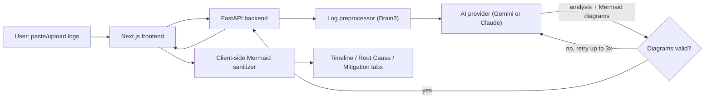

# DevOps AI Log Analyzer

## Overview
An AI-powered DevOps incident analysis system that ingests logs, identifies root causes, and generates structured mitigation plans. Designed for SREs, platform engineers, and DevOps teams to accelerate troubleshooting and incident response.

### Problem
Critical outages can cause huge business loss and companies can lose customers. DevOps engineers are usually required to quickly identify root cause and implement a fix. Sometimes these incidents happen over the weekend or at times when it is difficult for a DevOps engineer to be immediately available. 
AI powered incident analyzer helps in performing detailed analysis and sharing mitigation plan with DevOps engineers so that they can solve incidents faster.

### Outcome
AI system was successful in identifying root cause from a set of logs related to Kubernetes, System, Nginx and also share insights on how it could be solved. The system was testing mainly with Kubernetes related logs. 

## Demo
### Product Screenshots
### Home page


1. Manual and automated log analysis methods
    a. Manual method    - Log file (support .log or .txt files) can either be uploaded or logs can directly be pasted into the text box
    b. Automatic method - Linux (host machine) or Docker related logs can be automatically fetched by the application 
2. Click on Analyze button

### Analysis


Detailed timeline of the investigation performed by the AI tool is dispalyed.

### Root cause identification


Root cause identification page displays more details about the root cause, possible gaps and further insights which will assist in fixing the issue.

### Mitigation plan


Mitigation plan page suggests possible solutions along with a rollback plan in case the suggested solution does not work as expected.

### Execute actions
DevOps engineers can execute recommended commands from the tool. Currently, the AI model does not have access to directly execute commands and only executes them when a user approves it


### AI-generated diagrams
Each of the three analysis tabs (Investigation Timeline, Root Cause, Mitigation Plan) is paired with an AI-generated [Mermaid](https://mermaid.js.org/) flowchart that visualizes the same content — click any diagram to expand it. The backend validates the AI's Mermaid output and asks the model to regenerate it (up to 3 attempts) if it finds syntax problems, and the frontend applies a defensive sanitizer as a final safety net before rendering.

## Tech Stack
------------------------------------------------------------------
| Layer       | Tech                                             |
|-------------|--------------------------------------------------|
| Frontend    | Next.js 14, Tailwind, React, Mermaid              |
| Backend     | FastAPI, Pydantic, Uvicorn                        |
| AI/ML       | Google Gemini and Anthropic Claude (switchable)   |
| Auth        | JWT Header-based (MVP)                            |
------------------------------------------------------------------

## Architecture
[UI: Next.js] → (Paste/Upload Logs) → [Backend: FastAPI] → (Preprocess & Chunk) → [AI Engine] → (Structured JSON + Mermaid diagrams) → [UI Tabs]

- **Frontend**: Next.js + Tailwind + Lucide Icons + Mermaid diagram rendering
- **Backend**: FastAPI + Pydantic validation + JWT Role Check
- **AI Layer**: Gemini or Claude (`AI_PROVIDER` env var, JSON schema / tool-use enforced) with Mermaid diagram validation and regeneration on syntax errors
- **Log Preprocessor**: Log parsing using Drain3, Context-aware chunking, error sampling, deduplication
- **Output**: Strict Pydantic schema mapped to 3 exact UI tabs, each with a companion diagram



## Installation

### 1. Backend Setup

Requires Python 3.11–3.13 (pydantic-core does not yet have prebuilt wheels for 3.14; if you only have 3.14 installed, use [uv](https://docs.astral.sh/uv/) to fetch a compatible interpreter as shown below).

```bash
cd backend
uv venv --python 3.12 venv   # or: python -m venv venv, if you already have Python 3.11-3.13
source venv/bin/activate.fish   # bash/zsh users: source venv/bin/activate
uv pip install -r requirements.txt   # or: pip install -r requirements.txt
# export AI_PROVIDER="gemini"   # or "claude"
# export GEMINI_API_KEY="your-gemini-key"
# export ANTHROPIC_API_KEY="your-anthropic-key"
# export JWT_SECRET="your-secret"
uvicorn main:app --reload --port 8000
```

### 2. Frontend Setup
```bash
cd frontend
npm install
npm run dev
```

Visit http://localhost:3000

## How to use?

Paste logs or upload .log or .txt file
Click Run Analysis
View structured results across 3 tabs - Investigation Timeline, Root cause summary, Mitigation plan

## Project structure
```
ai_log_analyzer/
├── backend                                  # FastAPI based backend
│   ├── ai_service.py                        # AI service - LLM
│   ├── auth.py                              # Authentication service
│   ├── database.py                          # Database service
│   ├── log_processor.py                     # Log processing based on Drain3
│   ├── main.py                              
│   ├── requirements.txt
│   └── schemas.py
├── frontend                                  # Next.js based frontend
│   ├── app
│   │   ├── dashboard
│   │   │   ├── history                      # Job history
│   │   │   │   ├── [id]
│   │   │   │   │   └── page.tsx
│   │   │   │   └── page.tsx
│   │   │   ├── page.tsx
│   │   │   └── users                          # User management
│   │   │       └── page.tsx
│   │   ├── globals.css
│   │   ├── layout.tsx
│   │   ├── login                              # Login page
│   │   │   └── page.tsx
│   │   └── page.tsx
│   ├── components                            # UI Components for frontend
│   │   ├── AnalysisTab.tsx
│   │   ├── AppHeader.tsx
│   │   ├── ClampedText.tsx
│   │   ├── DiagramLayout.tsx                # Sidebar/banner layout for a tab's diagram
│   │   ├── LogInput.tsx
│   │   ├── LogUploader.tsx
│   │   ├── MermaidDiagram.tsx               # Renders + sanitizes AI-generated Mermaid diagrams
│   │   └── TabViews
│   │       ├── MitigationTab.tsx
│   │       ├── RootCauseTab.tsx
│   │       └── TimelineTab.tsx
│   ├── lib
│   │   ├── api.ts                           
│   │   └── types.ts
│   ├── next-env.d.ts
│   ├── package-lock.json
│   ├── package.json
│   ├── postcss.config.js
│   ├── tailwind.config.js
│   └── tsconfig.json
├── docs                           
│   ├── ai-dev
|   |   ├── README.md               # Details on how AI was used in the development of this project
└── README.md
```

## Reflection
The primary goal of this project was to build a system that can perform analysis of logs and share detailed results with regards to root cause analysis and mitigation plan. This was successfully achieved. This also encouraged in taking further steps in implementing features like Solution documentation creation and identifying ways to reduce the load off engineers during outages.
